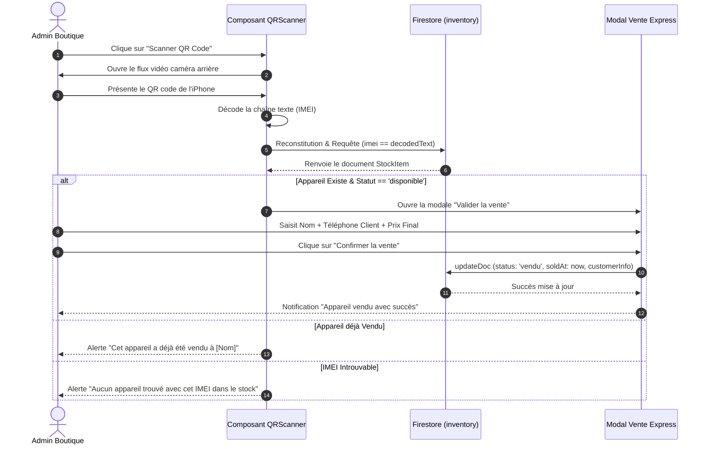

# 📋 Cahier des Charges Technique & Design — Sakho Apple

> **Projet** : Sakho Apple — Plateforme E-Commerce Premium & Gestion de Stock IMEI / Scanner QR  
> **Version** : 2.0.0  
> **Date de révision** : 29 Juillet 2026  
> **Statut** : Document de Spécifications Système Officiel  

---

## 📑 Table des Matières

1. [Présentation Générale & Objectifs du Projet](#1-présentation-générale--objectifs-du-projet)
2. [Cahier des Charges Design (UI/UX & Design System)](#2-cahier-des-charges-design-uiux--design-system)
   - [2.1 Identité Visuelle & Direction Artistique](#21-identité-visuelle--direction-artistique)
   - [2.2 Système de Couleurs & Thématisation](#22-système-de-couleurs--thématisation)
   - [2.3 Typographie & Échelle de Titrage](#23-typographie--échelle-de-titrage)
   - [2.4 Composants UI & Micro-interactions](#24-composants-ui--micro-interactions)
   - [2.5 Ergonomie Mobile-First & Responsive Layout](#25-ergonomie-mobile-first--responsive-layout)
3. [Cahier des Charges Base de Données (Cloud Firestore)](#3-cahier-des-charges-base-de-données-cloud-firestore)
   - [3.1 Architecture du Système de Données](#31-architecture-du-système-de-données)
   - [3.2 Schéma Détaillé des Collections & Modèles TypeScript](#32-schéma-détaillé-des-collections--modèles-typescript)
   - [3.3 Droits d'Accès & Règles de Sécurité (Firestore Rules)](#33-droits-daccès--règles-de-sécurité-firestore-rules)
   - [3.4 Transactions & Flux de Données Métiers](#34-transactions--flux-de-données-métiers)
4. [Cahier des Charges Scanner IMEI & QR Code](#4-cahier-des-charges-scanner-imei--qr-code)
   - [4.1 Objectifs Fonctionnels du Scanner](#41-objectifs-fonctionnels-du-scanner)
   - [4.2 Architecture Technique du Scanner](#42-architecture-technique-du-scanner)
   - [4.3 Modes d'Utilisation (Direct Camera & Image Upload)](#43-modes-dutilisation-direct-camera--image-upload)
   - [4.4 Flux Métier Vente en Boutique via Scan](#44-flux-métier-vente-en-boutique-via-scan)
   - [4.5 Gestion des Erreurs & Fallbacks Manuels](#45-gestion-des-erreurs--fallbacks-manuels)
5. [Plan de Validation & Critères d'Acceptation](#5-plan-de-validation--critères-dacceptation)

---

## 1. 🎯 Présentation Générale & Objectifs du Projet

**Sakho Apple** est une plateforme web moderne et haut de gamme conçue pour la vente en ligne et en boutique d'appareils Apple (iPhones, MacBooks, iPads, Accessoires), ainsi que pour la gestion avancée des reprises (Trade-in), du stock unitaire identifié par **IMEI**, et des ventes flash promotionnelles.

### Objectifs Majeurs :
1. **Expérience Utilisateur d'Exception (Wow Factor)** : Offrir une interface utilisateur (UI/UX) qui rivalise avec les standards Apple (Bento Grid, glassmorphism, animations fluides).
2. **Gestion de Stock IMEI Unitaire & Vente Physique Rapid** : Permettre aux administrateurs de tracer chaque produit unique par son numéro IMEI via un **scanner de QR Code intégré**.
3. **Prise en Charge Multi-Canal** : Gérer simultanément la prise de commande e-commerce standard et les ventes directes en point de vente physique.
4. **Base de Données Temps Réel & Sécurisée** : Garantir l'intégrité des stocks et la protection des données clients via Cloud Firestore.

---

## 2. 🎨 Cahier des Charges Design (UI/UX & Design System)

Le design de Sakho Apple repose sur les principes du **Minimalisme Apple**, combiné aux tendances web modernes (Glassmorphism, Bento Grids, Micro-animations).

### 2.1 Identité Visuelle & Direction Artistique

- **Style Général** : Épuré, luxueux, futuriste et fonctionnel.
- **Aesthetic Principles** :
  - Utilisation de grands espaces blancs (whitespace) et de contrastes appuyés.
  - Cartes et conteneurs avec bordures subtiles (`border-white/10` ou `border-gray-200`) et ombre douce (`shadow-xl` ou `shadow-2xl`).
  - Effets de transparence dépolie (Backdrop Blur / Glassmorphism) pour la barre de navigation et les modales.

### 2.2 Système de Couleurs & Thématisation

Le système utilise une palette harmonieuse sur fond sombre élégant / clair selon le contexte :

| Usage | Couleur HSL / Hex | Définition Tailwind |
| :--- | :--- | :--- |
| **Fond Principal Dark** | `#000000` / `#09090b` | `bg-zinc-950` / `bg-black` |
| **Surface Cartes Dark** | `#18181b` / `#27272a` | `bg-zinc-900/80` avec `backdrop-blur-md` |
| **Accent Primaires Apple** | `#0071e3` (Blue) / `#2997ff` | `bg-blue-600` / `hover:bg-blue-500` |
| **Accent Gold Premium** | `#d4af37` / `#f59e0b` | `text-amber-400` / `border-amber-500/30` |
| **Texte Principal** | `#f4f4f5` | `text-zinc-100` |
| **Texte Secondaire** | `#a1a1aa` | `text-zinc-400` |
| **Erreur / Promo** | `#ef4444` / `#f43f5e` | `bg-rose-600` |
| **Succès / En Stock** | `#10b981` / `#22c55e` | `text-emerald-400` / `bg-emerald-500/10` |

### 2.3 Typographie & Échelle de Titrage

- **Police de Caractères** : `Inter`, `San Francisco` (`system-ui`, `-apple-system`, `sans-serif`).
- **Hiérarchie Typographique** :
  - **H1 (Hero Titre)** : `text-4xl` à `text-6xl`, `font-extrabold`, `tracking-tight`, avec dégradé textuel (`bg-clip-text text-transparent bg-gradient-to-r from-white to-gray-400`).
  - **H2 (Titres de Sections / Bento)** : `text-2xl` à `text-3xl`, `font-bold`.
  - **H3 (Titres de Cartes / Produits)** : `text-lg` à `text-xl`, `font-semibold`.
  - **Body (Textes courants)** : `text-sm` à `text-base`, `text-zinc-400`, `leading-relaxed`.

### 2.4 Composants UI & Micro-interactions

1. **Bento Grid System** :
   - Mise en page asymétrique modulaire pour présenter les catégories vedettes et promotions.
   - Effet survol : `hover:scale-[1.02] transition-all duration-300 ease-out`.
2. **Cartes Produits avec Sélection de Capacités (Variants)** :
   - Badges d'état de batterie (`Batterie 100%`, `Neuf Scellé`).
   - Switch dynamique entre les capacités (128GB, 256GB, 512GB, 1TB) recalculant le prix instantanément.
3. **Barre de Navigation Sticky Glassmorphic** :
   - Hauteur compacte, `sticky top-0 z-40 bg-black/70 backdrop-blur-xl border-b border-white/10`.
   - Indicateur de panier avec badge animé en temps réel.
4. **Boutons & CTA** :
   - Effet `active:scale-95` pour retour tactile instantané.
   - Effet Glow néon sur les boutons principaux d'achat.

---

## 3. 🗄️ Cahier des Charges Base de Données (Cloud Firestore)

La base de données repose sur **Google Cloud Firestore** (NoSQL temps réel document-orienté).

### 3.1 Architecture du Système de Données

```
Firestore Root
 ├── products/ (Collection des modèles de produits génériques)
 │    └── [productId]
 │         └── variants/ (Sous-collection optionnelle des déclinaisons)
 ├── inventory/ (Collection du stock unitaire physique avec IMEI)
 ├── orders/ (Collection des commandes en ligne & comptoir)
 ├── exchanges/ (Collection des demandes de reprise / échange)
 ├── flashSales/ (Ventes flash horodatées avec stocks dédiés)
 ├── promotions/ (Codes ou règles de réduction globaux)
 ├── categories/ (Catégories de produits: iPhones, Mac, iPads)
 ├── banners/ (Bannières promotionnelles du carrousel d'accueil)
 ├── settings/ (Paramètres du site: contacts, taux de change, WhatsApp)
 └── users/ (Comptes utilisateurs & profils d'administration)
```

### 3.2 Schéma Détaillé des Collections & Modèles TypeScript

#### 1. Collection `products`
Définit un produit catalogue général.

```typescript
export type ProductVariant = {
  storage: string;         // Ex: "128GB", "256GB", "512GB"
  price: number;           // Prix en FCFA (ex: 450000)
  isPromo?: boolean;       // Indicateur de promotion active
  promoPrice?: number;     // Prix réduit si promo
  originalPrice?: number;  // Prix barré
};

export type Product = {
  id: string;              // Auto-generated Firestore ID
  name: string;            // Ex: "iPhone 15 Pro Max"
  slug: string;            // URL-friendly unique ID (ex: "iphone-15-pro-max")
  categoryId: string;      // ID de la catégorie liée
  categoryName?: string;   // Nom dénormalisé pour optimiser les requêtes
  thumbnail: string;       // URL Cloud Storage ou CDN de l'image
  keywords: string[];      // Tableau de mots-clés pour la recherche rapide
  batteryHealth: string;   // Ex: "100%", "95%+", "Neuf"
  status: 'active' | 'inactive';
  hasIMEI?: boolean;       // VRAI si la gestion unitaire par IMEI est requise
  variants: ProductVariant[];
  createdAt?: any;         // FieldValue.serverTimestamp()
  promoEndDate?: any;
  sales?: number;          // Compteur de ventes cumulées pour le tri top sales
};
```

#### 2. Collection `inventory` (ou `stock`)
Définit chaque appareil physique présent en boutique, suivi individuellement par son **IMEI**.

```typescript
export type StockItem = {
  id: string;              // Auto-generated Firestore ID
  productId: string;       // Clé étrangère vers `products`
  productName: string;     // Ex: "iPhone 13 Pro"
  imei: string;            // Numéro IMEI unique (15 chiffres)
  storage: string;         // Ex: "256GB"
  status: 'disponible' | 'vendu';
  addedAt: any;            // FieldValue.serverTimestamp()
  soldAt?: any;            // Date d'enregistrement de la vente
  customerName?: string;   // Nom de l'acheteur (si vendu en boutique)
  customerPhone?: string;  // Téléphone de l'acheteur (si vendu en boutique)
  finalPrice?: number;     // Prix effectif de transaction
};
```

#### 3. Collection `orders`
Enregistre les commandes des clients web ou les transactions directes.

```typescript
export interface CartItem {
  id: string;
  productId: string;
  name: string;
  storage: string;
  price: number;
  quantity: number;
  thumbnail: string;
  imeiAssigned?: string;   // IMEI spécifique rattaché lors de l'expédition/vente
}

export interface Order {
  id?: string;
  customerName: string;
  customerPhone: string;
  customerAddress: string;
  items: CartItem[];
  total: number;
  status: 'En attente' | 'En cours' | 'Livrée' | 'Annulée';
  date: any;               // FieldValue.serverTimestamp()
}
```

#### 4. Collection `exchanges` (Reprise d'Ancien iPhone)
Gère le formulaire d'échange où un client propose son ancien téléphone.

```typescript
export interface ExchangeRequest {
  id: string;
  customerName: string;
  customerPhone: string;
  currentDeviceModel: string;  // Ex: "iPhone 11"
  currentStorage: string;      // Ex: "64GB"
  batteryHealth: string;       // Ex: "84%"
  deviceCondition: 'Comme neuf' | 'Bon état' | 'Écran rayé' | 'Problème technique';
  desiredProduct: string;      // Ex: "iPhone 14 Pro 128GB"
  estimatedTopUp: number;      // Rajout estimé en FCFA
  status: 'En attente' | 'Accepté' | 'Refusé' | 'Terminé';
  createdAt: any;
}
```

#### 5. Collection `flashSales`
Permet la gestion de ventes flash événementielles à durée limitée.

```typescript
export type FlashSaleVariant = {
  storage: string;
  originalPrice: number;
  discountPrice: number;
  initialStock: number;
  sold: number;
};

export type FlashSale = {
  id: string;
  productName: string;
  slug: string;
  thumbnail: string;
  variants: FlashSaleVariant[];
  endDate: any;            // Firestore timestamp de fin
  status: 'Actif' | 'Programmé' | 'Terminé';
  createdAt: any;
};
```

### 3.3 Droits d'Accès & Règles de Sécurité (`firestore.rules`)

Le modèle d'accès applique le principe du moindre privilège :

- **Lecture Publique** (`allow read: if true`) : `products`, `categories`, `banners`, `promotions`, `flashSales`, `inventory` (disponibilité uniquement).
- **Création Publique** (`allow create: if true`) : `orders` (n'importe quel client peut passer commande), `exchanges` (demandes de reprise).
- **Administration Restreinte** (`allow create, update, delete: if isAdmin()`) : réservé aux utilisateurs ayant un document dans `/users/{uid}` avec `role: "admin"`.

```javascript
function isAdmin() {
  return request.auth != null &&
    get(/databases/$(database)/documents/users/$(request.auth.uid)).data.role == "admin";
}
```

---

## 4. 📷 Cahier des Charges Scanner IMEI & QR Code

Le module **Scanner** est l'outil central pour la gestion des stocks en boutique et l'enregistrement ultra-rapide des ventes physiques sans saisie manuelle lourde.

### 4.1 Objectifs Fonctionnels du Scanner

1. **Identification Instantanée** : Détecter le numéro IMEI d'un appareil à partir d'un QR code étiqueté sur la boîte ou la fiche de l'appareil.
2. **Recherche Automatique dans la Base de Données** : Interroger la collection `inventory` pour vérifier la validité et le statut (`disponible` / `vendu`).
3. **Passage de Vente Comptoir en 1-Clic** : Ouvrir immédiatement un formulaire pré-rempli pour saisir les coordonnées du client (`Nom`, `Téléphone`, `Prix de vente effectif`) et valider la sortie de stock.
4. **Gestion Multi-Caméras & Import Photo** : Basculer entre les caméras avant/arrière d'un smartphone/tablette ou importer une photo/capture d'un QR code.

### 4.2 Architecture Technique du Scanner

- **Bibliothèque Cœur** : `html5-qrcode` (v2.3.8+).
- **Composant React** : `@/components/admin/qr-scanner.tsx`.
- **Rendu HTML5 Canvas/WebRTC** : Utilisation du flux vidéo direct sous contrainte `facingMode: "environment"`.

```typescript
const scanner = new Html5QrcodeScanner(
  'qr-reader',
  { 
    fps: 10, 
    qrbox: { width: 250, height: 250 },
    aspectRatio: 1.0,
    videoConstraints: { facingMode: "environment" }
  },
  /* verbose= */ false
);
```

### 4.3 Modes d'Utilisation (Direct Camera & Image Upload)

1. **Mode Caméra Vidéo Temps Réel** :
   - Activation automatique du capteur dorsal du smartphone ou de la webcam du PC.
   - Zone de visée dynamique 250x250 pixels.
   - Capture en continu avec taux d'échantillonnage de 10 FPS.
2. **Mode Import d'Image (Fallback Upload)** :
   - Fichier supporté : `.jpg`, `.png`, `.webp`, `.heic`.
   - Traitement asynchrone via `Html5Qrcode.scanFile(file, true)` lorsqu'une caméra est indisponible ou de mauvaise qualité.

### 4.4 Flux Métier Vente en Boutique via Scan



### 4.5 Gestion des Erreurs & Fallbacks Manuels

- **Problème de Permission Caméra** : Message d'avertissement incitant l'utilisateur à autoriser la caméra ou à basculer vers le mode **Upload d'image**.
- **Luminosité Insuffisante / Code Rayé** : Champ de recherche manuelle en haut de page du stock avec autocomplétion par IMEI, Modèle ou Client.
- **Validation d'IMEI** : Contrôle de format (15 chiffres numériques) avant enregistrement pour prévenir la saisie de faux IMEI ou d'erreurs de frappe.

---

## 5. ✅ Plan de Validation & Critères d'Acceptation

| Domaine | Critère à Valider | Méthode de Test | Résultat Attendu |
| :--- | :--- | :--- | :--- |
| **Design** | Réactivité Mobile & Tablettes | Inspection Chrome DevTools / Mobile réels | Aucune rupture de layout, menu hamburger & bento grid fluides |
| **Design** | Tempos d'animation & Survol | Interactivité UI | Feedback visuel immédiat (< 100ms) au survol et au clic |
| **Base de Données** | Création de Commande Publique | Test d'achat sans compte utilisateur | Document créé dans `/orders` avec statut "En attente" |
| **Base de Données** | Protection Admin | Tentative d'écriture non authentifiée sur `/products` | Rejet strict par Firestore Security Rules |
| **Scanner** | Lecture QR Code par Caméra | Test sur iPhone / Android avec QR code IMEI | Décodage correct < 1 seconde et pré-remplissage immédiat |
| **Scanner** | Détection d'état Vendu | Scan d'un QR code dont le stock est statut `vendu` | Blocage de la double vente avec affichage des infos du 1er client |
| **Scanner** | Import Photo | Upload d'une capture d'écran de QR code | Décodage et confirmation de la vente équivalente |

---

> *Fin du Cahier des Charges Technique & Design — Sakho Apple.*
